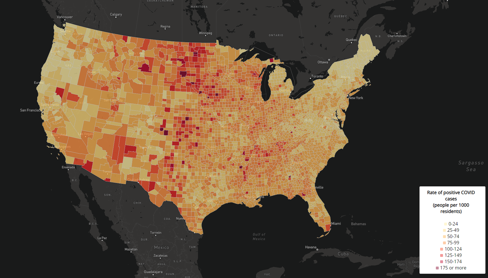

# Lab 3: Web Map Application

This lab was to get an introduction of how to navigate Mapbox library in Javascript by visualizing a chloropleth map and a proportional symbol map. Our goal included visualizing data for COVID 2020 cases in the US while creating an appealing design that is highly legible as well. Our data was taken from the [New York Times](https://github.com/nytimes/covid-19-data/blob/43d32dde2f87bd4dafbb7d23f5d9e878124018b8/live/us-counties.csv), [2018 ACS 5 year estimates](https://data.census.gov/cedsci/table?g=0100000US.050000&d=ACS%205-Year%20Estimates%20Data%20Profiles&tid=ACSDP5Y2018.DP05&hidePreview=true), and the [US Census Bureau](https://www.census.gov/geographies/mapping-files/time-series/geo/carto-boundary-file.html), which gave us cases and rates of cases per county (1000 residents) of COVID-19 in the US in 2020, the latter two sources being used to create the COVID case rates per 1000 residents. Shapefiles of the data were taken and converetd into geoJSON files via [mapshaper](https://mapshaper.org/), which allows us to simplify and compile data into a clean format that is usable by mapbox to visualize thematic maps.

# Maps

## Chloropleth map of COVID case rates in the US

[Link to Map](map1.html)

## Proportional Symbol Map of COVID cases in each county in the US

[Link to Map](map2.html)

# Acknowledgement

The data was processed by Steven Bao for this lab.